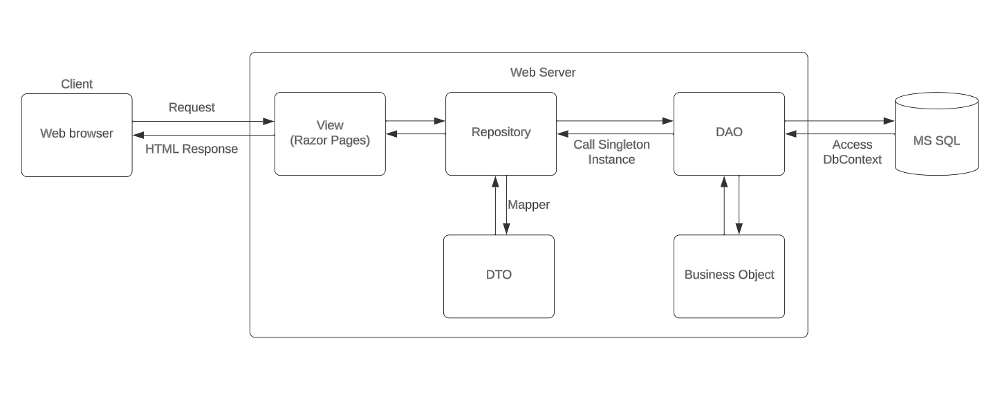
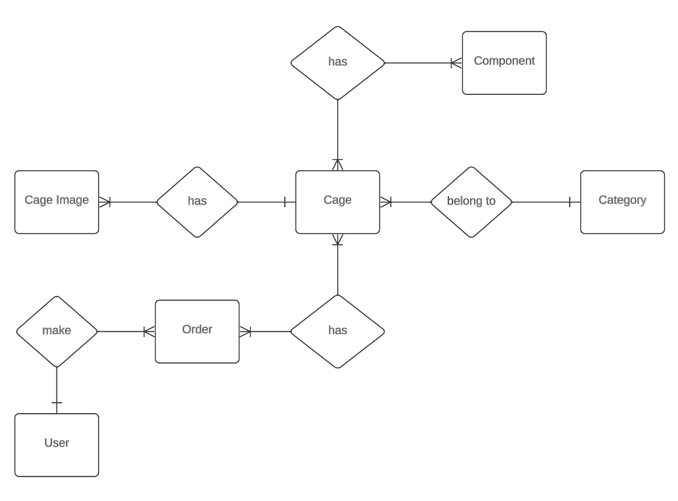
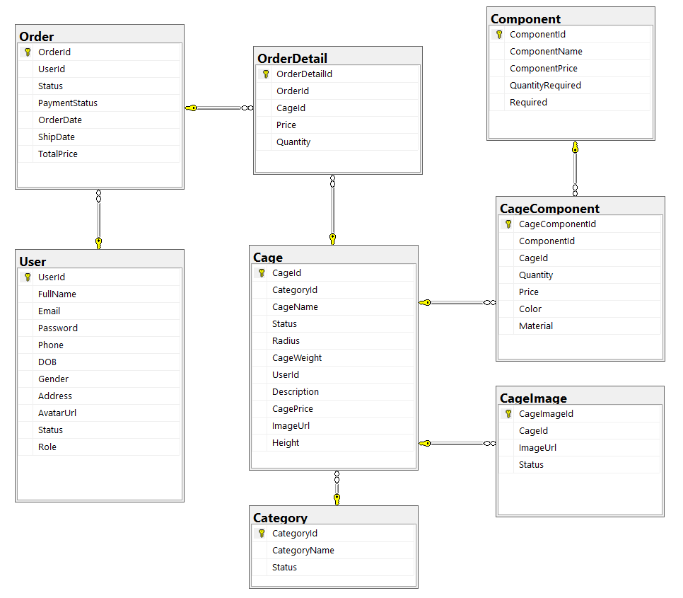

# Bird Cage Shop

    

    
    
    
    

## Introduction

Bird Cage Shop is a management system for shop and bird cage manufacturer. Aside from basic function of a normal e-commerce website, it also provide feature that allows users to customize their own bird cage. The project is for the course Advanced Programming with .NET at FU.

## System Design

    
    
Architecture Design

    
    
Conceptual Database Design

    
    
Implemented Database

## Contributors

